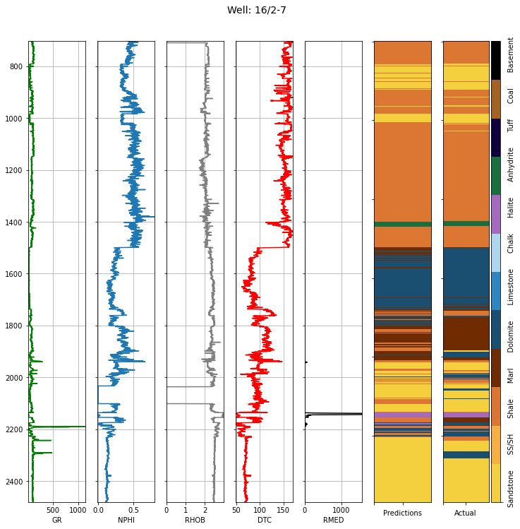

Overview
========

This package was created to aid and automate petrophysical interpretation
of well logs. It helps in the reading of las files, estimating petrophysical 
properties like the volume of shale, porosity, log permeability, water and 
oil saturation. It also aids in the visualization of these logs by plotting 
dynaminc logs to depth.

This package also provides machine learning support by helping to predict 
and estimate missing well log data from other wells. Lithology values can be predicted 
as well as the lithofacies of such wells to depth.

This package also contains multiple functions that can help in machine learning 
data preparation and preprocessing stages. The functions are used in the creation 
of the package and are also reusable by individual users for their needs.

Quick Start
============

Example.::

   import petroeval as pet
   print(pet)

   >>> <petroeval object at 0x7fd171c18450>

-------------

Complete tutorial examples are found in the repo below:

https://github.com/olawaleibrahim/beta-tests/tree/main/petroeval